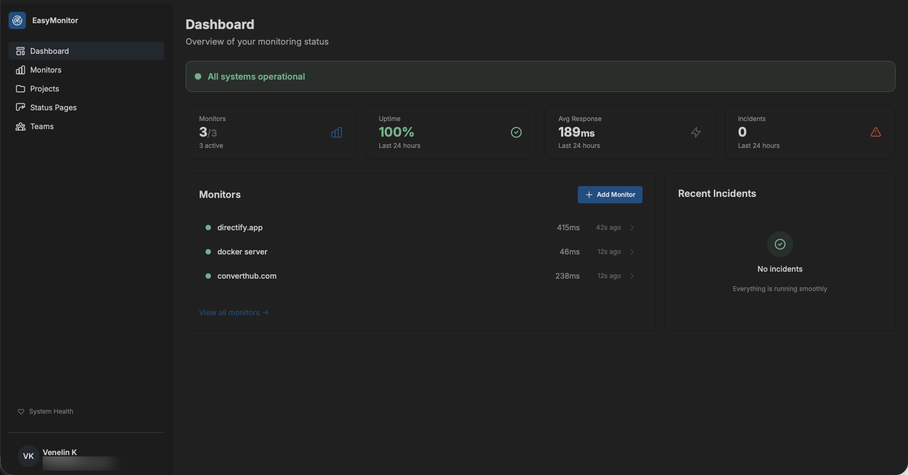

# EasyMonitor

> Open-source, self-hosted uptime and performance monitoring you can run with one `docker compose up`.


EasyMonitor is a full-stack monitoring platform for your websites and APIs. Add a URL, pick an interval, and get alerted when something breaks. Group monitors into projects, share live status with your users via public status pages, and run probes in multiple regions to eliminate false positives.

## Screenshot

<!-- Replace public/img/dashboard.png with your own screenshot. -->


---

## Features

- **HTTP, ICMP, and TCP port checks** — every 30 seconds to 1 hour per monitor
- **SSL certificate expiry monitoring** — captured during HTTPS checks; alerts at 30/14/7 days before expiry
- **Multi-region probes** — lightweight Go binaries (~10 MB) you can deploy anywhere
- **Consecutive-failure threshold** — configurable per monitor; no alerts on flaky single failures
- **Multi-channel alerts** — email, Slack, Discord, generic webhooks (HMAC-signed), and Pushover (per-user, per-monitor selection) on down and recovery
- **Projects** — group related monitors (e.g. main site + APIs)
- **Teams** — share monitors and projects with collaborators with role-based access
- **Status pages** — public, unlisted (secret link), or private
  - Add projects (live link) or individual monitors
  - Hide specific monitors per page
  - Themes, custom CSS, logo upload
  - Incidents and scheduled maintenance with timeline updates
  - Custom domains with auto-HTTPS via Caddy on-demand TLS
- **TimescaleDB** — efficient time-series storage for check results
- **Redis Streams** — reliable job bus between scheduler, probes, and result consumer
- **Laravel Horizon** — queue dashboard for ops visibility

## Architecture

```
                       ┌──────────────────────────┐
                       │  Laravel + Livewire UI   │
                       │  (admin + public pages)  │
                       └────────────┬─────────────┘
                                    │
                XADD checks         │         consumes results
                ┌───────────────────┴───────────────────┐
                ▼                                       ▲
       ┌────────────────┐                       ┌──────┴────────┐
       │ Redis Streams  │ ◀──── XADD results ───┤ Probe nodes   │
       │ checks/results │    (HTTP, ICMP, TCP)  │ (Go, multi-r.)│
       └────────────────┘                       └───────────────┘
                │
                ▼
       ┌──────────────────────────┐
       │ PostgreSQL + TimescaleDB │
       │ (hypertable for checks)  │
       └──────────────────────────┘
```

## Stack

- **Backend:** Laravel 12, PHP 8.4, Livewire 3
- **Frontend:** Tailwind CSS 4, DaisyUI 5, Alpine.js (bundled with Livewire)
- **Probe:** Go 1.24 (separate binary, multi-architecture)
- **Database:** PostgreSQL 18 + TimescaleDB 2.26
- **Message bus:** Redis 7 Streams
- **Web:** Caddy 2.10 (HTTPS) → Nginx → PHP-FPM (with Supervisor + Horizon)

## Quick start

### Prerequisites

- Docker and Docker Compose v2
- ~2 GB free RAM (4 GB comfortable for production)
- Linux, macOS, or WSL2

### One command

```bash
git clone https://github.com/easymonitordev/easymonitor.git
cd easymonitor
./setup.sh
```

The installer is interactive and walks through:

1. **Mode** — local development or production
2. **Domain + admin email** (production only) — auto-detects your server's public IP and verifies DNS
3. **Database** — auto-generates strong password in production
4. **Redis password** — optional
5. **Registration policy** — open or first-user-only
6. **Email driver** — log only, Amazon SES, or generic SMTP
7. **Pushover** — optional; paste an application token to enable push alerts
8. **Object storage** — local disk, Cloudflare R2, or Amazon S3

It then:

- Writes `.env`
- Patches `docker/caddy/Caddyfile.production` for production installs
- Builds and starts all containers
- Generates app key, JWT secret, probe token
- Runs migrations
- Builds frontend assets
- Sets up the storage symlink

When it finishes, open the URL it prints. The first user can register and becomes the admin.

## Adding a probe in another region

A local probe runs by default. To add probes in other regions, they need a network path to the server's Redis. **Never expose Redis directly on the public internet** — use a private network tunnel instead.

Supported options:

- **Tailscale** (recommended) — two commands on server and probe, done
- **Cloudflare Tunnel** — free, zero ports exposed
- **Manual** — SSH tunnel, WireGuard, your own VPN

The `setup.sh` installer has a "Will you run probes on other machines?" prompt that auto-installs Tailscale on the server if you pick that option.

The probe node itself lives in a separate repo so you can deploy it on any host without cloning the full EasyMonitor app:

- **Probe repo:** [github.com/easymonitordev/probe-node](https://github.com/easymonitordev/probe-node)
- **Pre-built image:** `easymonitor/probe-node:latest` (Docker Hub) — mirror at `ghcr.io/easymonitordev/probe-node:latest`

Full server-side tunnel setup (Tailscale / Cloudflare / manual) and probe-side `docker run` details are in [PROBE_NODE_SETUP.md](PROBE_NODE_SETUP.md).

To disable the bundled local probe:

```bash
docker compose up -d --scale probe=0
```

## Custom domains for status pages

When using the production Caddyfile (configured automatically by `setup.sh` for production installs), customers can point their own domain at your EasyMonitor instance:

1. In the status page settings, they enter `status.theircompany.com`
2. They add the displayed TXT record at their DNS provider for verification
3. They CNAME their domain to your EasyMonitor host (gray cloud / DNS only on Cloudflare)
4. Click **Verify Domain** in the UI

Caddy then provisions a Let's Encrypt certificate automatically on the first request via on-demand TLS. The app gates which domains are allowed via a `/caddy/ask` endpoint that checks the `domain_verified_at` flag.

## Notifications

Each user chooses where their alerts go from **Settings → Notifications**. Every monitor picks a subset of the user's configured channels; new monitors default to the user's default channel.

Supported channels:

| Channel | Setup | Per-user config |
|---------|-------|-----------------|
| Email | Configured by the admin via `MAIL_MAILER` (log, SES, SMTP) | Uses the account email |
| Slack | No admin setup — Slack-side only | User adds one or more [incoming webhooks](https://api.slack.com/messaging/webhooks), each labelled (e.g. `#alerts-api`, `#alerts-frontend`) — pick which ones to alert per monitor |
| Discord | No admin setup — Discord-side only | User adds one or more [channel webhooks](https://support.discord.com/hc/en-us/articles/228383668) (Server Settings → Integrations → Webhooks), each labelled — pick which ones to alert per monitor |
| Webhook | No admin setup | User adds one or more HTTP endpoints (any URL) — each gets an auto-generated HMAC-SHA256 secret. Payloads are signed with `X-EasyMonitor-Signature: sha256=…` and tagged with `X-EasyMonitor-Event: monitor.down\|monitor.recovered\|certificate.expiring`. Pipe to PagerDuty, Zapier, n8n, custom services |
| Pushover | Admin sets `PUSHOVER_APP_TOKEN` once (from [pushover.net/apps/build](https://pushover.net/apps/build)) | User pastes their user key (and optional device) |

Send-test buttons on the Notifications page let each user verify their configuration end-to-end.

### Webhook payload

Webhook deliveries are HTTP `POST` with `Content-Type: application/json`. Two events fire — one when a monitor crosses the failure threshold and one when it recovers.

**Headers**

| Header | Value |
|--------|-------|
| `X-EasyMonitor-Event` | `monitor.down`, `monitor.recovered`, or `certificate.expiring` |
| `X-EasyMonitor-Signature` | `sha256=<hex>` — HMAC-SHA256 of the raw body using your channel's secret |
| `User-Agent` | `EasyMonitor-Webhook/1.0` |

**`monitor.down` body**

```json
{
  "event": "monitor.down",
  "monitor": {
    "id": 42,
    "name": "Production API",
    "url": "https://api.example.com/health",
    "check_type": "http"
  },
  "error": "Get \"https://api.example.com/health\": dial tcp: connection refused",
  "checked_at": "2026-05-14T13:42:07+00:00",
  "dashboard_url": "https://easymonitor.example.com/monitors/42"
}
```

`error` is `null` when the failure has no diagnostic message. `check_type` is `http`, `icmp`, or `tcp`.

**`monitor.recovered` body**

```json
{
  "event": "monitor.recovered",
  "monitor": {
    "id": 42,
    "name": "Production API",
    "url": "https://api.example.com/health",
    "check_type": "http"
  },
  "checked_at": "2026-05-14T13:48:32+00:00",
  "dashboard_url": "https://easymonitor.example.com/monitors/42"
}
```

**Verifying the signature**

Compute HMAC-SHA256 over the *raw* request body using the secret shown in your channel settings, then compare against the `X-EasyMonitor-Signature` header (without the `sha256=` prefix) using a constant-time comparison.

```python
import hmac, hashlib

def verify(body: bytes, header: str, secret: str) -> bool:
    expected = "sha256=" + hmac.new(secret.encode(), body, hashlib.sha256).hexdigest()
    return hmac.compare_digest(expected, header)
```

```php
$expected = 'sha256='.hash_hmac('sha256', $rawBody, $secret);
$ok = hash_equals($expected, $request->header('X-EasyMonitor-Signature'));
```

```js
import { createHmac, timingSafeEqual } from "node:crypto";

function verify(body, header, secret) {
  const expected = "sha256=" + createHmac("sha256", secret).update(body).digest("hex");
  return timingSafeEqual(Buffer.from(expected), Buffer.from(header));
}
```

Always sign the **raw bytes** of the body, not a re-serialized version — re-encoding can change byte-for-byte content (whitespace, key order) and the signature won't match. In Express, that means `express.raw({ type: 'application/json' })`. In Laravel, `$request->getContent()`.

**Delivery semantics**

Deliveries are best-effort with a 10s timeout. Failed deliveries are logged but not retried — design your receiver to be tolerant of duplicates if you queue/process asynchronously, and idempotent on `monitor.id + event + checked_at`.

## Configuration

Most settings live in `.env`. Notable ones beyond the standard Laravel set:

| Variable | Default | Purpose |
|----------|---------|---------|
| `REGISTRATION_ENABLED` | `false` | When false, only the first user can register |
| `JWT_SECRET` | auto-generated | Used to sign probe authentication tokens |
| `PROBE_NODE_ID` | `local-node-1` | Identifier for the bundled probe |
| `PROBE_REDIS_URL` | `redis://redis:6379/0` | Probe Redis connection (use `rediss://` for TLS) |
| `FILESYSTEM_DISK` | `local` | Switch to `s3` for R2 or S3 |
| `MAIL_MAILER` | `log` | Use `ses` or `smtp` for real delivery |
| `PUSHOVER_APP_TOKEN` | _(empty)_ | Application token from pushover.net/apps/build — unlocks the Pushover channel for users |

## Development

```bash
docker compose exec php composer install
docker compose exec php php artisan migrate
docker compose exec php npm run dev
```

### Tests

```bash
docker compose exec php php artisan test
```

The test suite uses SQLite in-memory and covers auth, monitors, projects, teams, status pages, custom domains, and the public rendering layer.

### Code style

```bash
docker compose exec php vendor/bin/pint --dirty
```

## Contributing

Contributions welcome. Fork, branch, write tests for your change, run the suite, and open a PR. CI runs `pint` and the test suite on every push.

## License

MIT — see [LICENSE](LICENSE).

---

EasyMonitor — monitoring made easy, wherever you deploy.
